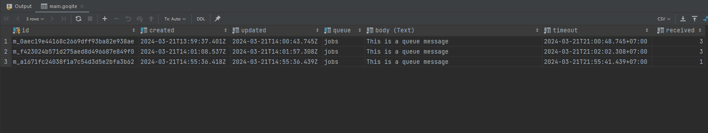
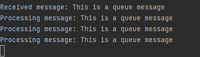

## Goqite message queue library (much simpler usage of queue concept)

    ├── db                          # Folder related to database migration
        ├── db.go                   # File with migration code inside
    ├── helpers                     # Folder for helper file
        ├── queue.go                # File with queue method to create queue message it self
    ├── goqite.db                   # Database SQlite for goqite persistence message
    ├── main.go                     # Entry Point file
    └── README.md                   # Docs file

- Installation 
  - just `go mod tidy`
  - then execute `go run ./main.go`

- What is this project about ( actually just little bit exploration 😄 )
  - Simulate how to create message queue, this is simpler implementation about queue message 
    than Kafka, Rabbit MQ (maybe overkill for your small project)
  - Here I already simulate how to send a queue (dont worry it will persistance in our SQlite db),
    then how to consume it, set time to live of the queue message and so on.
  - Then I also simulate about how the service or backgroud job can running using concurrent process of
    Golang to keep consume the queue, then you can execute any business logic or API call.
  - Finally, I will keep explore this project on the future, maybe using job scheduler, API call or 
    integrate it with background service, so be ready 😎

- This an image of how the queue message stored in SQlite (goqite) table
  -   
- This an image of how to queue message consumed 
  - 

